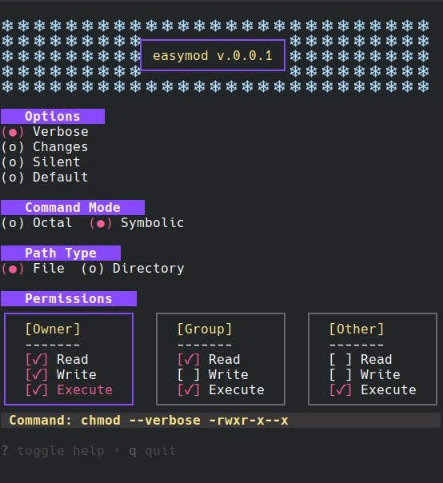

# EasyMod
A simple TUI-based CLI tool for generating Linux file permissions. Select readable options for owner, group, and others to instantly get the equivalent chmod command in both numeric and symbolic formats — easy to learn, easy to copy.


<p align="center">
   
</p>

## Installation
#### Build from source
```sh
$ git clone github.com/ppriyankuu/easymod
$ cd easymod
$ make install
$ make run
```

## Navigation
| Key                      | Description                            |
| -----------------------  | -------------------------------------- |
| <kbd> up </kbd>          | Move up in the current section         |
| <kbd> down </kbd>        | Move down in the current section       |
| <kbd> left </kbd>        | Move left in the current section       |
| <kbd> right </kbd>       | Move right in the current section      |
| <kbd> tab/space </kbd>   | Move to the next section               |
| <kbd> shift+tab </kbd>   | Move to the previous section           |
| <kbd> shift+tab </kbd>   | Move to the previous section           |
| <kbd> Enter </kbd>       | Select/toggle current item             |
| <kbd> Ctrl+c </kbd>      | Copy command                           |
| <kbd> Shift+? </kbd>     | toggle help                            |
| <kbd> q </kbd>           | quit                                   |

## Built with
- [Bubbletea](https://github.com/charmbracelet/bubbletea)
- [Lipgloss](https://github.com/charmbracelet/lipgloss)
- [Urfave/cli](https://github.com/urfave/cli/v2)
- [Clipboard](https://github.com/atotto/clipboard)
